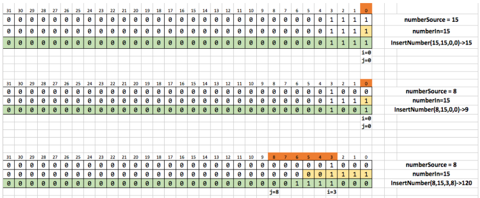

## Task description ##

Two integer signed numbers and two positions of bits i and j (i < j) are given. Implement the algorithm for inserting one number into another according to the following rule - take the first j - i + 1 bits from the source number and replace by them bits from the i-th to j-th destination numbers (bits are numbered from left to right). **Use only bit operations to solve.**

*Topics - bit operations.*
